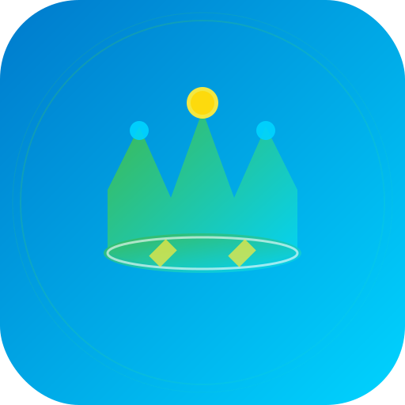
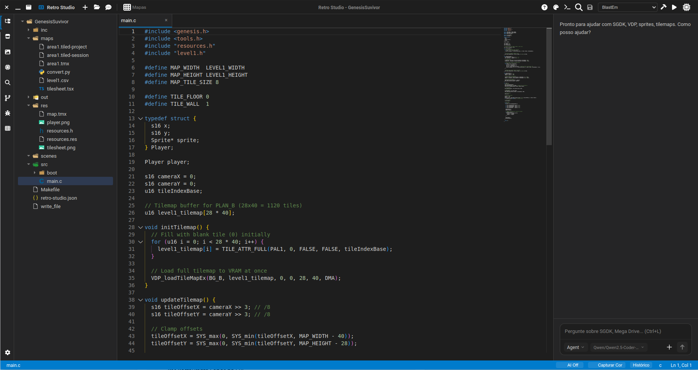
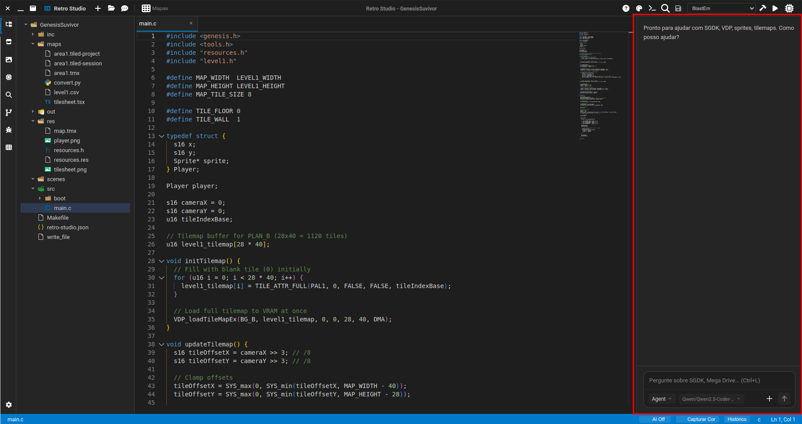
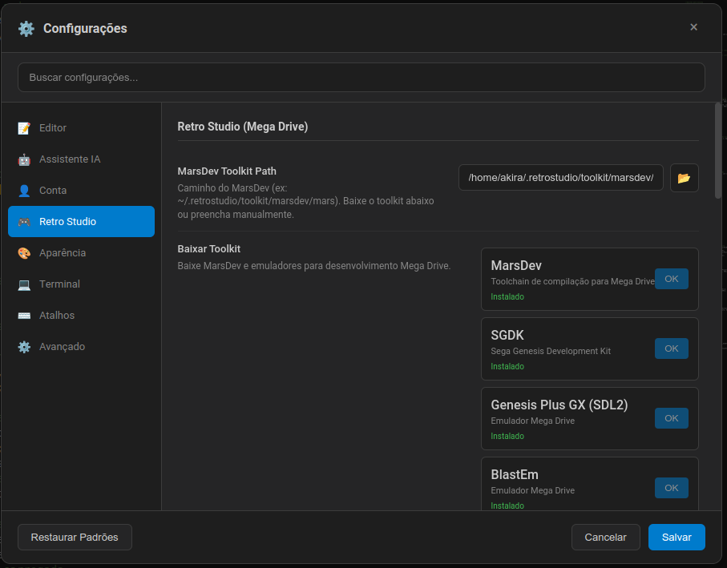

# Retro Studio

<p align="center">
  
</p>

**IDE para desenvolvimento de jogos Sega Mega Drive (Genesis)** com suporte a SGDK, MarsDev e ferramentas integradas.

[English](README.en.md) · [Español](README.es.md) · [日本語](README.ja.md)

---

## Sobre

Retro Studio é uma IDE desktop para criar jogos retro no Sega Mega Drive. Inclui editor de código, gerenciador de assets, editor de tilemaps, terminal integrado, build/emulador e assistente de IA para desenvolvimento com SGDK.



### Recursos

- **Editor de código** — Monaco Editor com syntax highlighting para C/SGDK
- **Gerenciador de assets** — Importe sprites, tilemaps, sons
- **Editor de tilemaps** — Crie e edite mapas visuais
- **Build integrado** — Compile com MarsDev/SGDK em um clique
- **Emulador** — Execute o jogo diretamente na IDE
- **Assistente IA** — Qwen, vLLM e outros para ajudar no código
- **Git integrado** — Controle de versão na interface







---

## Instalação

### Pré-requisitos

- Node.js 18+
- MarsDev Toolkit (baixável pela própria IDE)

### Desenvolvimento

```bash
git clone https://github.com/retro-studio/retro-studio.git
cd retro-studio
npm install
npm run dev
```

### Build para distribuição

```bash
npm run build
npm run build:linux   # AppImage, .deb
npm run build:win     # Windows
npm run build:mac     # macOS
```

---

## Como contribuir

Contribuições são bem-vindas! Veja como participar:

1. **Fork** o repositório
2. Crie uma **branch** para sua feature (`git checkout -b feature/nova-funcionalidade`)
3. **Commit** suas alterações (`git commit -m 'Adiciona nova funcionalidade'`)
4. **Push** para a branch (`git push origin feature/nova-funcionalidade`)
5. Abra um **Pull Request**

### Diretrizes

- Siga o estilo de código existente
- Inclua testes quando aplicável
- Documente alterações significativas
- Para bugs, use o template de issue

### Código de conduta

Seja respeitoso e construtivo. O projeto segue um ambiente colaborativo e inclusivo.

---

## Licença

Este projeto está sob a licença **MIT**. Você pode usar, modificar e distribuir o software, inclusive para fins comerciais e monetização. Veja o arquivo [LICENSE](LICENSE) para detalhes.

---

## Créditos

- [SGDK](https://github.com/Stephane-D/SGDK) — Sega Genesis Development Kit
- [MarsDev](https://github.com/andwn/marsdev) — Toolchain Mega Drive
- [Monaco Editor](https://microsoft.github.io/monaco-editor/) — Editor de código
- [Electron](https://www.electronjs.org/) — Framework desktop

---

<p align="center">
  Feito com ❤️ para a cena retro
</p>
